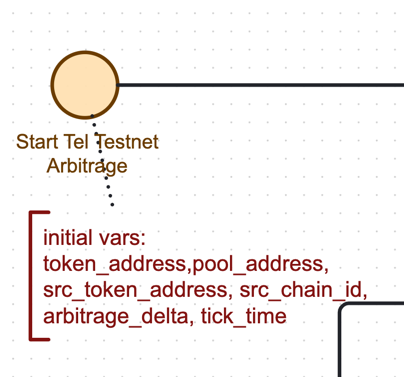
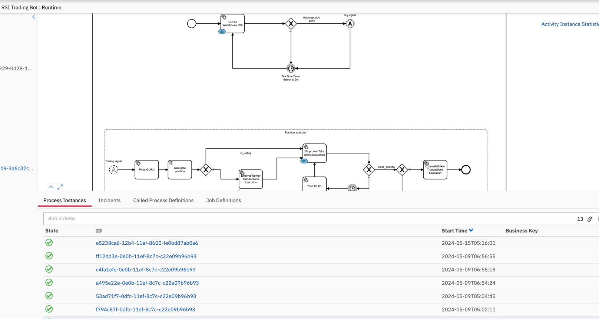
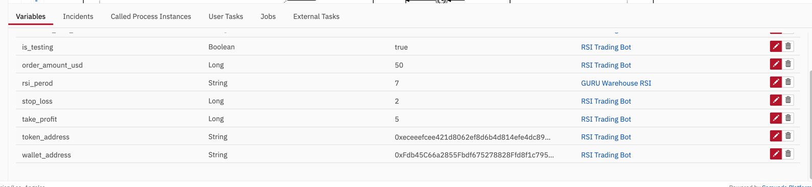
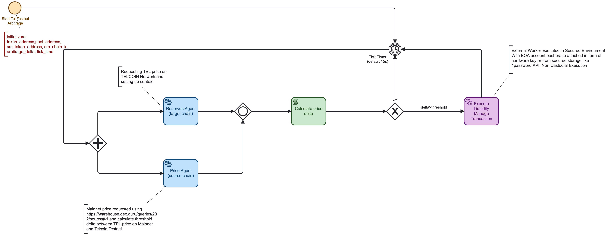

# Telcoin Association Testnet Arbitrage Web3 Automation Process

This document outlines the process definition for setting up arbitrage strategies on the Telcoin
Association [Testnet DEX](https://swap.telcoin.network/) for the native $TEL token.

## Assets on Telcoin Testnet:

- **gUSD testnet stable:** [0xA2C07C15173C183771FFAd40c2e972F97e0bCe64](https://scan.telcoin.network/address/0xA2C07C15173C183771FFAd40c2e972F97e0bCe64)
- **WTEL wrapped native:** [0x80d1f6dafc9c13e9d19aedf75e3c1e2586d4a2a5](https://scan.telcoin.network/address/0x80d1f6dafc9c13e9d19aedf75e3c1e2586d4a2a5)

### Testnet DEX gUSD/WTEL Pool:

[0xe2005c7718f3849f39c65b8ea93c7a7030aec463](https://scan.telcoin.network/address/0xe2005c7718f3849f39c65b8ea93c7a7030aec463)

### Example of swap transaction:

[Transaction Link](https://scan.telcoin.network/tx/0x1ca744072d2515cece14e5c09b7d3f468d9f39d2e5a3889eeb49884665fe5a48)

## Arbitrage Process Definition

The process is executed on the DexGuru Web3 Automation engine.

It begins by reading price data from the Data Warehouse for
the [TEL token on ETH Mainnet](https://dex.guru/token/eth/0x467bccd9d29f223bce8043b84e8c8b282827790f). Simultaneously,
it requests reserves for TEL/gUSD, along with prices from the TEL on ETH Mainnet, to compute arbitrage opportunities.

The transaction compute task currently calculates the price delta and builds a transaction for non-custodial execution
by an agent. Future updates may introduce more complex logic for Smart Liquidity management.

Based on the calculated delta and a predefined arbitrage threshold, a decision is made whether to execute a transaction.
If affirmative, the pre-calculated transaction is sent for execution by a non-custodial agent, which operates
pre-provisioned liquidity in both gUSD and wTEL. This agent is deployed on DexGuru’s infrastructure within a Kubernetes
cluster, with security ensured by secrets stored in a cluster vault.

### Monitoring and Management

The process management and monitoring are visualized in the Flow product, which will be launched alongside DexGuru V2
at [https://flow.dex.guru](https://flow.dex.guru).

## BPMN Diagram

The process is defined in a BPMN diagram, where pre-defined snippets are orchestrated and stitched together from
different execution contexts like chains, tokens, pools, and compute along with the user's actions flow. The diagram can
be viewed and edited through [Camunda Modeler](https://camunda.com/download/modeler/) or any BPMN-compliant editor
like [bpmn.org](https://www.bpmn.org/).

File link: [telcoin_arbitrage.bpmn](telcoin_arbitrage.bpmn)
